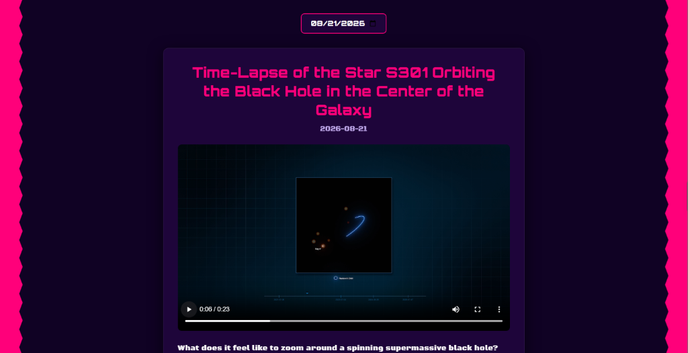

# NASA Astronomy Picture of the Day (APOD)

A web app using NASA's API to display eye-watering pictures from light centuries (instead of light years) away wowwww.



## Live demo

[View the live site on GitHub Pages](https://arhambafna.github.io/nasa-astro-image/).

## Features

- Shows daily astronomy pictures/video from NASA.
- Same but for past dates too.
- Handles all media types (YouTube, photo, whatever).
- It doesnt look generational, but okay (keeping it honest).

## Running locally

### Prereqs
- [Node.js](https://nodejs.org/) (18+ i think)
- [Git](https://git-scm.com/) (everyone has this)

### How to

```bash
git clone https://github.com/ArhamBafna/nasa-astro-image.git
cd nasa-astro-image
npm install
npm run dev
```
(thats for windows bc i use windows)

### NASA API key (optional)

It works with NASA's default demo key, but thats limited and getting your own to run locally is much better.

1. Get key from api.nasa.gov.
2. Copy `.env.example` to `.env`.
3. Edit .env with the key you just got.

## How it works

Basically, in simple terms:
- In browser using vanilla JavaScript + Vite. It sends requests to the NASA APOD API.
- The thing adjusts based on media type.
- The design uses CSS to make it beautiful (chill, i'll work on design).

## Credits

- [NASA APOD API](https://api.nasa.gov/) for image and video data.
- [Google Fonts](https://fonts.google.com/) for Orbitron and Black Ops One fonts.
- Built for the [Hack Club](https://hackclub.com/) Stardance event. ITS PEAKKK CHECK IT OUT!!!!
